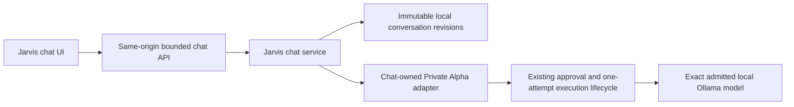
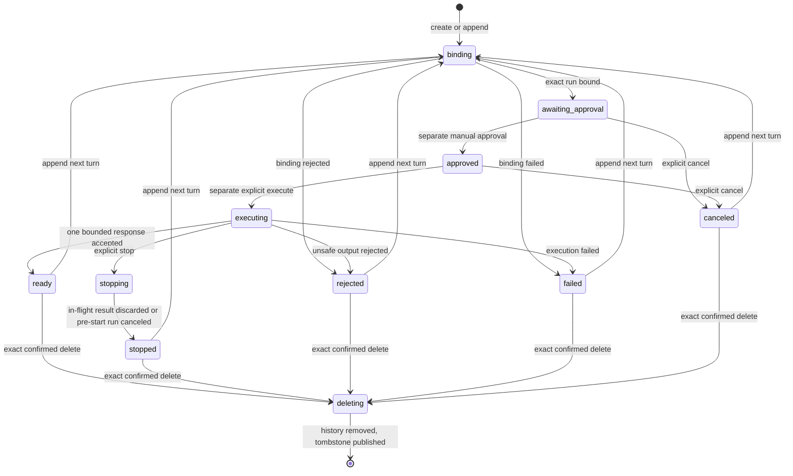

# Canonical local-first Jarvis chat lifecycle

## Product status

The canonical Jarvis chat is **Working** for bounded, local-first text conversations. It is a server-owned conversation lifecycle, not a browser-only transcript and not the retired `/ai` workspace. Each turn is bound to the already-established Private Alpha approval and execution boundary.

The currently bound runtime is exact:

- provider: `ollama-local` (`Local Ollama`);
- model key: `ollama-local::gpt-oss:20b`;
- runtime model: `gpt-oss:20b`;
- data boundary: `local-machine`;
- maximum output: 4,096 tokens;
- cost classification: local, with no provider token charge;
- streaming: unavailable in this version;
- fallback, retry, model substitution, paid routing, automatic approval, and automatic execution: unavailable.

Provider availability is not probed merely by opening or reading chat. The interface states `not-checked` until an explicitly approved execution reaches the provider lifecycle. A local runtime can still be unavailable at execution time.

## Architecture and ownership

`/jarvis` is the single canonical conversational workspace. The client uses strict typed API responses, while all identity creation, policy validation, lifecycle transitions, persistence, Private Alpha binding, and execution decisions remain on the server.

The adapter does not duplicate provider transport. It creates a server-derived, non-forgeable chat ownership binding over the conversation, turn, and run. Generic Private Alpha APIs cannot list, read, approve, cancel, or execute chat-owned runs. Creator-owned runs remain isolated in the same way.

## Conversation and turn lifecycle

A newly submitted message becomes one durable turn. Creation and append first publish a recoverable binding intent, then bind exactly one Private Alpha run. The normal lifecycle is:

Illegal or stale transitions fail closed. Approval and execution are distinct user actions with distinct idempotency keys and exact revision preconditions. Execution has one attempt. A repeated matching request returns the exact recorded response revision; a reused key with a different canonical request digest conflicts. No retry, fallback, rerouting, model substitution, or hidden paid execution occurs.

Stop is honest: if provider work has already started and the established transport cannot terminate it, Jarvis records `stopping`, discards any later output, and completes `stopped`. It does not claim remote cancellation. Cancel is available before execution and cancels the exact owned run.

## Context and memory

Every appended turn exposes a user-controlled choice:

- `conversation`: include only a bounded, ordered selection of prior messages from this same conversation;
- `none`: send only the current user message and the fixed chat instruction envelope.

The persisted provider envelope records the chosen mode, exact referenced message identities and digests, omitted-count evidence, byte count, and request digest. Context never crosses a conversation boundary. There is no hidden memory injection, implicit repository content, creator artifact content, screen content, credential content, or external account content.

Three useful tools formerly reachable only from the retired `/ai` workspace are preserved behind Jarvis's initially collapsed **Advanced context and planning tools** disclosure:

- reviewed Brain recall can be loaded only after the user stores it from Brain Recall and then chooses the visible load action in Jarvis;
- evidence-grounded chat shows the exact selected evidence prompt before it can be placed in the composer;
- the self-upgrade console remains a bounded planning backlog, not an execution mechanism.

Stored recall is treated as untrusted browser input: Jarvis bounds and validates its schema, rebuilds the visible prompt from the validated cards and policy, and rejects malformed or oversized records. Choosing **Use in chat** only replaces the visible composer draft and returns focus there. It never sends, approves, executes, or selects earlier conversation context automatically.

## Persistence, replay, restart, and concurrency

Chat data is server-owned below the Private Alpha data boundary in the dedicated `jarvis-chat` subtree. Deterministic tests use the separately labelled Private Alpha test root. Production data is never selected by a client-supplied path.

Each conversation has:

- a bounded reservation slot and server-generated conversation identity;
- immutable, contiguous, checksummed revisions;
- ordered turns and messages with server-generated identities and content digests;
- append-only audit and idempotency evidence;
- an exact pending-operation intent for crash recovery;
- nondecreasing timestamps, including after wall-clock rollback;
- bounded record, turn, revision, audit, and idempotency limits.

Publication is atomic and no-replace. Reads validate the complete revision chain rather than trusting only the latest file. Revision, digest, identity, ownership, history, and terminal-turn rewrites fail closed. Independent processes contend through the established native filesystem and lock boundaries; no same-process mutex is treated as sufficient evidence.

After interruption, only an explicit recovery request may reconcile the exact pending operation. Recovery is bound to the persisted request digest, original operation identity, current revision, and exact Private Alpha run. It does not create a second run or a second provider attempt. Refreshing or restarting reads the durable state and presents the appropriate next action.

## Rename and deletion

Rename is local and available only after a turn reaches a terminal state. It appends audit and idempotency evidence without changing prior messages or run provenance.

Delete requires the exact conversation ID as confirmation and an exact revision. It atomically publishes a deletion tombstone and removes the conversation history. The response exposes a stable deletion audit ID, canonical `conversation.deleted` event, deletion timestamp, and tombstone digest so the result is reviewable and replayable.

Deletion does **not** create, alter, or erase a Private Alpha run or audit record. If the chat lifecycle previously produced separately retained bounded Private Alpha run or audit provenance, that provenance remains unchanged for safety and execution accountability and remains inaccessible through generic Private Alpha controls. If binding failed before a run existed, deletion does not invent one. The UI must state this distinction before confirmation; it must not claim that every related audit record is erased or that every conversation necessarily has retained run provenance.

## HTTP and client boundary

Mutation endpoints accept only exact JSON on a validated loopback, same-origin authority. Requests have bounded streamed bodies, duplicate JSON keys are rejected, mutation idempotency keys are required, and existing-conversation mutations require an exact `If-Match` revision. Host, scheme, port, Origin, route parameters, list limits, and content type fail closed. Absolute persistence paths, credentials, provider choices, models, arbitrary commands, and run ownership cannot be supplied by the client.

Responses use bounded stable error codes and safe messages. They do not expose absolute paths, prompts beyond the user-visible envelope, credentials, or raw internal exceptions. The browser client accepts only allowlisted API targets and exact response schemas. It verifies the actual HTTP status against the embedded replay status, conversation ownership, nested identity formats, revision/audit consistency, provider envelope, deletion evidence, and JSON content type.

## Security posture

- User text and model output are data, never executable authority.
- Secret-like user text is rejected before persistence; secret-like or malformed assistant output is not added to the transcript.
- Output is rendered as text by React; it is not inserted as raw HTML.
- No chat action applies patches, runs shell commands, installs packages, deploys, sends communications, captures a screen, or accesses a microphone.
- The global Private Alpha kill switch is checked by the existing execution lifecycle. Unsafe kill-switch state fails closed there.
- Opening, listing, or loading chat performs no provider request and no availability probe.
- Generic and creator mutation routes cannot reserve or control the chat-owned idempotency/run domain.
- Bounded audit history records request, binding, approval, execution, stop/cancel, result, recovery, rename, and deletion transitions without provider credentials.

## Route and product map

The user-facing product is CodexForge; the repository's historical `health-tracker` directory name is not product identity.

| Route or area | Status | Purpose |
| --- | --- | --- |
| `/` | Working | Authentic CodexForge home and navigation entry. |
| `/jarvis` | Working | Canonical local-first conversational assistant and advanced evidence entry. |
| `/athena` | Redirect | Redirects to `/jarvis`; the duplicate primary workspace is retired. |
| `/ai` | Intentionally retired | Redirects to `/jarvis`; its legacy unsafe POST endpoint returns a bounded retirement response. Dedicated routes retain specialist workflows, while recall, evidence-grounding, and self-upgrade planning are explicitly available in Jarvis's collapsed advanced tools. |
| `/jarvis-websites` | Working | Bounded static Website/Browser App v0 creator; no backend, packages, deployment, or full-stack claim. |
| `/jarvis-chatbot` | Legacy but unique functionality pending migration | Chatbot-brain planning/foundation surface, not the canonical chat. |
| Home | Working | `/`. |
| Jarvis | Working | `/jarvis`. |
| Projects | Partial | `/video-projects`; project-oriented work is present but not every creator type is operational. |
| Assets | Partial | `/video-assets`; bounded review surface only. |
| Providers | Partial | `/provider-adapters`; provider evidence and controls remain bounded by admission policy. |
| Workflows | Partial | `/video-workflows`; workflow review, not arbitrary execution. |
| Trading | Partial | `/jarvis-trading`; research only, with no live trading claim. |
| Audit and Runs | Partial | `/jarvis-audit`; bounded run/audit inspection. |
| Safety and Settings | Partial | `/jarvis-safety`; safety posture and settings, not a claim of every integration. |
| Project Files | Working | `/files`; local project-file workspace under its existing boundaries. |
| Patch Review | Partial | `/patch-preview-workbench`; review only and no automatic apply. |
| Validation | Partial | `/validation`; bounded validation evidence only. |

Direct URLs, desktop/mobile navigation, command-palette entries, redirects, and breadcrumbs must agree with this map. Existing source contains a much larger historical route inventory; no route is removed merely to simplify navigation, and unique functionality must be migrated before retirement.

The complete before/after page inventory is deterministic: baseline `a8ea7b5a4b91937152d16279f876364187a2c318` and the stabilized worktree each contain exactly 4,018 `src/app/**/page.tsx` paths, with zero added and zero removed. All 4,018 retained page paths keep their existing route classification except the explicitly migrated current-facing entries above: `/ai` changes from a legacy workspace to an intentional redirect; `/clawd` keeps its unique operator functionality while its chat wording points to `/jarvis`; `/entry` keeps its unique quick-launch form while handing the exact visible prompt to canonical Jarvis; and `/tasks` keeps its reviewed-task functionality while its copy-only handoff wording names Jarvis. The named table is therefore the complete set of route-status changes; every other retained route remains `Working`, `Partial`, or `Legacy but unique functionality pending migration` according to its unchanged implementation and historical registry classification.

## Accessibility and responsive journey

The normal `/jarvis` experience puts conversation history, New chat, transcript, composer, context choice, Send, Stop, approval/execution controls, runtime identity, and recovery actions before an initially collapsed advanced-tool disclosure. It maintains one page H1, logical DOM and keyboard order, visible focus, mobile reflow without horizontal overflow, labelled inputs, and stable visible `aria-describedby` reasons for disabled controls. Status changes are announced without using a live region as the sole disabled explanation. Focus returns to the meaningful next control after mutation or an explicit advanced-tool draft handoff.

## Deterministic validation

The required lifecycle smoke uses only test-owned roots and a local fixture adapter at the public Private Alpha provider seam. Fixtures are never a production success fallback. It covers create/list/load, exact replay and conflict, explicit context, separate approval and execution, one assistant response, stop/cancel/recovery, restart and clock rollback, rename/delete/tombstone evidence, cross-conversation isolation, unsafe input/output rejection, generic Private Alpha isolation, HTTP request enforcement, strict client decoding, response loss with one retained client key, and stable published-slot corruption. Exact get, immutable-revision get, and list all fail closed when a stable published slot has lost its required tree; independent delete/list contention is separately required to reconcile without treating an observed lifecycle transition as corruption.

The independent-process gate races same-key and distinct-key conversation publication, then races exact same-key deletion with concurrent list reads. It requires one canonical deletion tombstone, one original deletion response, exact replay responses for matching callers, a stable conflict for a different deletion key, no `500`, and no unrelated conversation change. The main lifecycle harness traps fetch, network, production transport, credential resolution, downloads, arbitrary child processes, package installation, deployment, and production persistence mutation; each counter must remain zero. Every independent create, delete, conflict, and list child installs the same prohibited-activity trap and reports zero counters. The orchestration driver is separately limited to launching those exact workers and using the deterministic fixture lifecycle; its output labels the aggregate explicitly as child-worker evidence. Owned deterministic roots are removed through their test lifecycle.

The aggregate release gate registers this smoke once as required after Macro D2. Focused checks precede Browser acceptance and the one-shot full wrapper.

## Controlled live acceptance

After deterministic gates pass, one separately controlled localhost-only acceptance may use an already installed, canonically admitted Ollama `gpt-oss:20b` model. It must use the 4,096-token envelope, one approval, one explicit execution, and one attempt. There is no retry, fallback, substitution, cloud contact, credential read, model download, or deployment. If Ollama or that exact installed model is unavailable, the live check is reported unavailable rather than replaced with a fixture or another model.

For this checkpoint, controlled live-model acceptance is **Unavailable**: the repository has no reviewed runner that combines one real installed `gpt-oss:20b` call with isolated test-owned chat persistence, exact one-attempt/no-fallback enforcement, and zero production-data mutation. Deterministic lifecycle, API, Private Alpha, Browser, and concurrency evidence are authoritative; none is represented as a live Ollama response.

## Recovery and cleanup

For an interrupted deterministic run:

1. verify the exact test-root label, ownership, node types, and containment;
2. never follow a symlink, junction, or reparse target;
3. use only `cleanupTestData` for the chat subtree and the established deterministic Private Alpha lifecycle for its exact suffix;
4. quarantine ambiguous residue recoverably instead of deleting it;
5. confirm the production `.codexforge/private-alpha` tree is byte-identical and creator test roots are untouched;
6. rerun the focused gate only after the deterministic roots are absent.

For a user conversation interrupted during a mutation, reload it and choose the visible explicit recovery action. Do not resubmit with a new key unless intentionally starting a new action. If persistence validation fails, leave the data untouched and surface the bounded recovery error for operator review.

## Current limitations

- Text chat only; streaming is unavailable.
- Exactly one admitted local model/runtime binding in this phase.
- Provider context is current-conversation-or-none, within bounded message and byte limits. Reviewed recall or evidence can be placed visibly into the current draft only by explicit user action; there is no global autonomous memory or hidden injection.
- No cloud or paid provider execution, model fallback, model download, automatic retry, or provider cancellation guarantee.
- No automatic code application, shell execution, package installation, deployment, email send, voice, screen control, image, audio, or video generation from chat.
- Deletion removes conversation history; it neither creates nor changes any separately retained bounded Private Alpha run/audit provenance.
- `/jarvis-chatbot` remains a separate legacy planning/foundation surface until its unique value is deliberately migrated.
