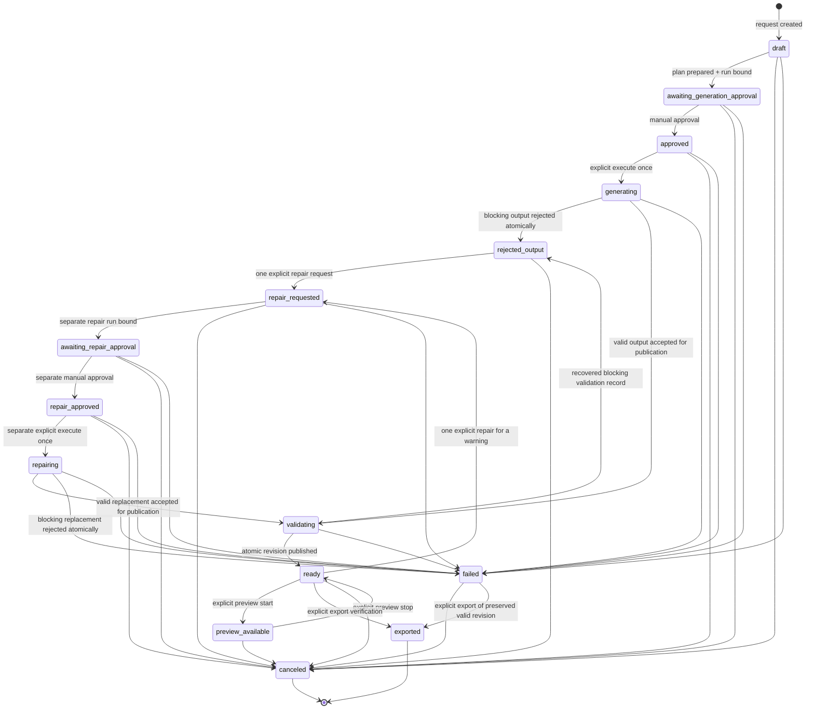

# Macro Phase D1: Shared Creator Lifecycle Foundation

## Operational status

Macro Phase D1 introduces a server-owned creator domain for CodexForge. Its first consumer is the static Website/Browser App v0 builder, while the domain names and lifecycle records are intentionally reusable by later game, Server/API, and video creators.

Jarvis remains the primary workspace. The creator does not add an Athena dashboard or a competing command center. The focused `/jarvis-websites` route is entered from Jarvis and provides an explicit return to `/jarvis`; the established `/athena` redirect and general Jarvis Private Alpha task loop remain unchanged.

This phase does not authorize live Ollama execution, Groq, paid calls, credential reads, model downloads, package installation, deployment, or production creator runs. Deterministic tests use isolated creator and Private Alpha test roots and fixture output only at an injected provider/service boundary.

## Architecture and reused primitives

The creator layer owns:

- typed requests, project identities, slugs, plans, approval packets, run bindings, artifacts, validation, materialization, preview, repair, export, audit, revision, idempotency, and bounded failure records;
- a fail-closed state machine;
- creator-specific filesystem containment, immutable state revisions, checksums, exact-byte-fenced exclusive lock files, same-directory state-file staging, and atomic whole-revision publication;
- strict loopback API guards, exact JSON media types, bounded streamed bodies, idempotency keys, and revision preconditions;
- creator UI state and public safe error messages.

It reuses, without modifying, the existing Private Alpha public server lifecycle:

- `createPrivateAlphaStore` / `createPrivateAlphaStoreForTesting`;
- exact local runtime profile and `ollama-local::gpt-oss:20b` binding;
- run creation in `awaiting_approval`;
- existing approval scope hashes and manual approval semantics;
- existing explicit `executeRun` one-attempt semantics;
- the existing Private Alpha kill switch before provider resolution and generation;
- the registered Ollama adapter and transport, never a duplicate creator transport.

The protected Ollama transport accepts one approved user-role message. The creator therefore combines its exact instruction envelope and bounded user brief into that one approved request. It does not add a second provider message path or change transport behavior.

## Exact model and data envelope

| Field | Exact value |
|---|---|
| Provider key | `ollama-local` |
| Model key | `ollama-local::gpt-oss:20b` |
| Runtime model | `gpt-oss:20b` |
| Data boundary | `local-machine` |
| Maximum output tokens | `4096` |
| Retry | disabled |
| Fallback | disabled |
| Model substitution | disabled |
| Paid execution | disabled |

Creator planning never probes availability. Availability and provider activity remain inside the separately approved, explicitly executed Private Alpha operation.

## State diagram



Every status change is checked against the transition table. Same-status record updates, such as recording completion of deterministic validation, still create a new immutable state revision and audit event. Terminal states cannot silently advance.

## Approval and execution sequence

1. The operator submits a bounded title and brief with an idempotency key.
2. The server persists `request.created` in `draft`.
3. The server prepares the exact plan, destination, policy, model envelope, and plan digest.
4. The creator adapter creates one exact Private Alpha run using a server-derived stable idempotency key.
5. The creator persists its source run ID, Private Alpha revision, approval scope hash, provider/model/data identity, instruction digest, exact source artifact revision, exact target artifact revision, and exact immutable creator-owned destination, then enters `awaiting_generation_approval`.
6. The operator separately approves. The adapter calls existing `approveRun`; no execution occurs. The creator persists `approval.recorded` and enters `approved`.
7. The operator separately requests execution. The creator first persists `execution.requested` and `generating`, then calls existing `executeRun` with a stable server-derived key.
8. There is one attempt. Every returned or recovered terminal Private Alpha result is checked against the exact run ID, approval scope, request-envelope digest, provider, model, data boundary, server-derived execution idempotency hash, output text/hash pair, and exact successful/blocked/failed revision shape before its terminal identity is persisted. A mismatch becomes a bounded terminal failure instead of advancing validation. There is no retry, fallback, substitution, automatic repair, or hidden paid route.
9. Received output is parsed and validated in memory before any artifact file is published. A blocking result atomically persists only bounded validation findings, run provenance, failure state, idempotency, and audit; the invalid proposal itself is never admitted through the stricter artifact-persistence schema.
10. A valid exact bundle enters `validating`; a second kill-switch check occurs before materialization. If it is engaged, the server returns a bounded refusal while leaving that exact validated bundle recoverable in `validating`; a later explicit replay of the same execution mutation can continue without another provider call. Only that exact accepted bundle can publish.

Private Alpha and creator state cannot share one filesystem transaction. Recovery uses deterministic creator project identity, stable Private Alpha idempotency, exact run bindings, immutable creator revisions, and explicit in-progress audit identities. A resumed request either reconciles the same run/result or fails closed; it never creates a hidden second attempt.

## Persistence, revisions, and concurrency

Production creator data is fixed at:

```text
.codexforge/creator/
  projects/<24-hex-project-id>/
    state-revisions/<six-digit-state-revision>.json
    revisions/<six-digit-artifact-revision>/
  locks/<project-id>.lock.json
```

Deterministic data is fixed at `.codexforge/creator-tests/<bounded-suite-id>`. Clients cannot supply either root.

Properties:

- state revisions are immutable, monotonically increasing files;
- every project read validates the complete contiguous revision chain from revision 1 through the requested/latest revision; project identity, request, creation time, plan, repair attempt, earlier audit/idempotency entries, materializations, and established run provenance are append-only or monotonic, and every successor must add its exact own-revision audit event;
- each state envelope contains a SHA-256 checksum of canonical project JSON;
- immutable state-revision writes use an exclusive same-directory temporary file, file sync, byte verification, and an atomic same-filesystem hard-link publication that fails with `EEXIST` instead of replacing a revision target;
- per-project owner files are transactionally published without replacement, so separate server instances cannot both acquire one project name;
- lock ownership records bind a nonce, process-session nonce, process ID, and timestamp. Stale takeover and release use the native compare-and-delete transaction against the exact bytes that were inspected or originally published. A delayed contender therefore cannot remove a fresh live owner. Only a structurally valid owner with a definitively absent distinct PID, or an exact in-memory nonce recorded after a same-process release failure, is displaced. Same-PID, live, ambiguous, malformed, and byte-mismatched owners fail closed for operator inspection;
- stale revisions and same-revision publication conflicts return stable failures;
- each idempotency key remains bound to one exact mutation kind and digest in both in-progress audit evidence and completed records; it cannot be rebound to another action after a lost response;
- audit and idempotency collections are capped at 128; capacity exhaustion rejects a future mutation instead of truncating history;
- requesting the one repair reserves enough remaining audit/idempotency capacity to bind, approve, execute, preview-start, preview-stop, and export; otherwise the request is refused while the valid `ready` state remains usable;
- orphan publication reconciliation requires the exact project/title/kind/revision/destination, source request and run identity, validation and inventory digests, materialization timestamp, and ordered deterministic audit-reference list; omitted, extra, reordered, or cross-purpose evidence fails closed;
- preview and export reread the immutable publication and require exact canonical equality with the state-approved manifest and materialization, not merely a self-consistent manifest digest;
- failed writes preserve the previous complete state and artifact revision;
- cleanup targets only a server-derived deterministic test suffix. A cleanup attempt permanently closes that retained root lifecycle even when it fails, so retry cannot reopen a substituted root path; a separately verified fresh lifecycle is required for recovery. Windows whole-revision publication creates no externally visible creator materialization stage.

## Filesystem containment

The creator uses its own conservative boundary rather than the generic artifact export or repository file writer. On Windows, a repository-owned native helper opens and retains a trusted creator-root handle chain. Every mutation and traversal is expressed as validated relative path segments and resolved from those retained handles. Each component is opened without following reparse points and is rejected when it is a symbolic link, junction, other reparse point, unsafe node type, or a root escape. Directory creation, exclusive file creation, linking, replacement, exact deletion, and whole-revision publication therefore occur at the trusted handle-relative boundary rather than through a path-verification-then-path-mutation sequence. If the native boundary is missing, cannot load, or the volume lacks the required transaction capability, creator filesystem mutation fails closed with bounded guidance to rebuild the bundled helper and use a compatible NTFS volume.

Windows artifact publication supplies one ordered tree of relative-segment paths and complete byte buffers to one native transaction. The transaction verifies all file bytes and immutable metadata before its sole commit; no materialization staging name or partial revision tree is externally visible. Creator and Private Alpha reads remain portable where their existing contracts allow, but filesystem mutation is currently supported only through this audited Windows boundary. Non-Windows mutation fails closed before creating persistence; there is no path-check-then-mutate fallback.

## API mutation boundary

Creator APIs are Node-only and dynamic. Mutations require:

- a runtime audit that finds at least one active TCP server listener and proves every active TCP server listener in the process is bound to `127.0.0.1` or `::1`; an unavailable listener audit, wildcard bind, or non-loopback bind returns a bounded unavailable response before Host/Origin checks;
- a loopback request URL;
- an exact same-origin `Origin` and, when supplied, `Sec-Fetch-Site: same-origin`;
- `application/json` or exact UTF-8 JSON content type;
- a streamed maximum body size of 16,384 bytes;
- an allowlisted 16–160 character `Idempotency-Key`;
- an exact `If-Match: "<revision>"` header matching the body revision for actions;
- strict known-key schemas.

The client never supplies a filesystem root, provider credential, model override, command, or arbitrary preview path. Responses use stable bounded codes and messages and do not expose absolute paths, instruction envelopes, raw internal exceptions, or credentials.

The creator must be launched on a loopback-bound product server, for example `node_modules\.bin\next.cmd dev --hostname 127.0.0.1` during local development or the corresponding `next start --hostname 127.0.0.1` after a build. The protected package scripts remain unchanged; their default wildcard listener is detected and creator APIs fail closed. A forged `Host`, `Origin`, `Sec-Fetch-Site`, or `X-Forwarded-For` header cannot turn a wildcard listener into an accepted creator transport because the decision is made from the process's active listening socket addresses.

## Audit contract

The bounded creator audit records request creation, plan preparation, run binding, approval, execution request, output receipt/rejection, validation, materialization, preview start/stop, repair request/run/result, manifest creation, export request, cancellation, and safe failure. Each event includes an ID, timestamp, actor, previous/resulting state, state revision, source run when relevant, artifact revision when relevant, and mutation/idempotency digests.

Provider credentials and unnecessary raw provider metadata are never copied into creator records. The bounded user request, parsed artifact proposal, validation, file inventory, hashes, source run identity, and audit provenance remain local.

## Recovery and cleanup

- Reload the project by its 24-hex ID to obtain the exact current state revision.
- If the client still retains the interrupted mutation key, it may retry that exact action with the same key and original expected revision.
- After a reload, the raw key is intentionally unavailable because the server stores only its hash. The operator may make a new explicit recovery action against the exact current intermediate revision. That path is restricted to the persisted action kind/status, run purpose, source run, request/validation digests, and immutable publication; it cannot trigger another provider attempt.
- A stale revision or different action/purpose fails closed and requires a new explicit user decision.
- Canceling an awaiting or approved run adopts the exact revision returned by Private Alpha into both the run binding and approval packet before publishing `canceled`; it does not claim cancellation of an in-flight provider request.
- A lock with a valid owner record is reclaimed only when the recorded process is definitively absent; an active, ambiguous, or malformed owner remains locked for exact operator inspection.
- Deterministic smokes remove only `.codexforge/creator-tests/<suite>` and their matching `.codexforge/private-alpha-tests/<suite>` roots after verifying containment.
- Production `.codexforge/private-alpha`, quarantine directories, source repositories, and prior valid creator artifact revisions are not cleanup targets.

Crash residue from state-file publication is narrowly recognizable, but production cleanup is manual-only in v0. Inspect read-only for exact creator-owned state siblings ending `.json.tmp-<16-hex>`. Native lock publication, exact-byte takeover, and release are transaction boundaries and do not use claim, stale, or released directory names. Windows native whole-revision publication exposes no materialization stage before commit and leaves no creator materialization stage residue. Before any reviewed removal, use the creator-owned native containment boundary, confirm the exact project/revision has no active canonical lock or pending recovery, and prove no published revision references the candidate. Use that boundary only on the one exact candidate; never recurse from `.codexforge`, the creator root, `private-alpha`, a quarantine path, or the repository root. Canonical `.lock.json` files with live, same-PID, malformed, ambiguous, or byte-mismatched ownership are inspection targets, not automatic cleanup targets.

## Current limitations

This lifecycle foundation does not provide non-Windows creator mutation, background jobs, multi-node distributed locks, a global creator-project/disk quota, provider cancellation, automatic retry, automatic repair, credential management, deployment, or package execution. Non-Windows mutation remains fail-closed because the portable pathname implementation is not a substitute for the Windows trusted-handle boundary under the hostile same-user race model. Per-project limits and filesystem containment do not eliminate local disk-exhaustion risk across many explicitly created projects. The active-listener audit uses Node's process-local handle inventory; if that inventory is unavailable or ambiguous, creator requests fail closed. It is designed for the direct local product server, not an externally exposed reverse proxy. STOP prevents future actions and stops preview, but it does not claim to terminate an already in-flight Ollama request because the established transport has no cancellation contract.

If a process stops after an immutable artifact directory is published but before `ready` is persisted, either the retained original key or a new explicit action against the exact current intermediate revision can resume from `validating`. Recovery verifies the complete publication, hashes, source request, run purpose, source run, validation digest, and deterministic audit references before adopting it. A generation action cannot adopt a repair publication, and recovery never calls the provider a second time.
